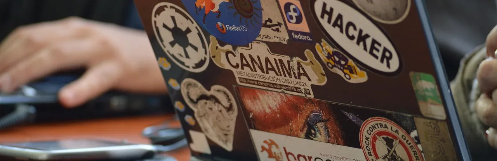

## Cosa fa un hacker?
Diversamente da come lo dipingono i media, cioè come un pirata informatico o chi invia virus, ransomware o lancia attacchi informatici, l'[hacker](https://it.wikipedia.org/wiki/Hacker) è semplicemente una persona curiosa che smonta, rimonta, studia qualsiasi cosa per il gusto di farlo e per raggiungere anche degli obiettivi "smanettando". Spesso è un termine legato al mondo della cybersicurezza ma non è così.

## Cos'è quindi il CivicHacking?
E' un termine che non ho sentito molto usare, ma se non ha una sua definizione gliela darò io:

**fare hacking per la collettività e il territorio**.

Il Civic Hacking diventa quindi usare la propria curiosità per aiutare le persone, trovare soluzioni e sperimentare nel mondo digitale con lo scopo di partecipare attivamente alla vita democratica del proprio paese, mettendosi a disposizione di tutti le proprie scoperte o soluzioni, così come il mondo open source insegna.

## Si ma... qualche esempio?
Lo puoi trovare tra [i miei progetti](/progetti), se pur qualcuno iniziato da poco (per iniziare qualcosa di utile serve tempo, sperimentare e trovare qualcosa che può fare la differenza).