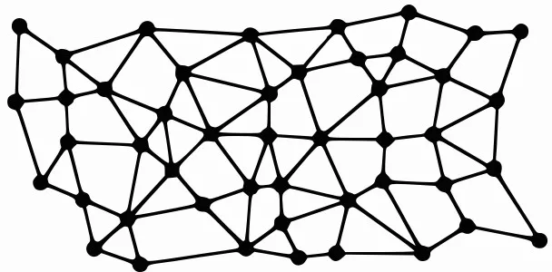
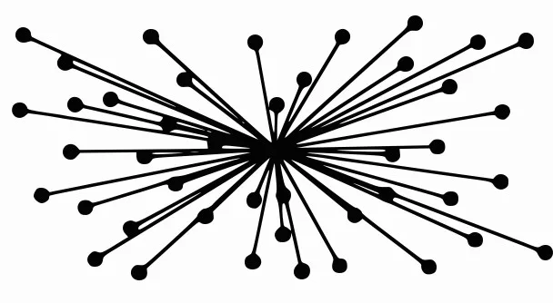
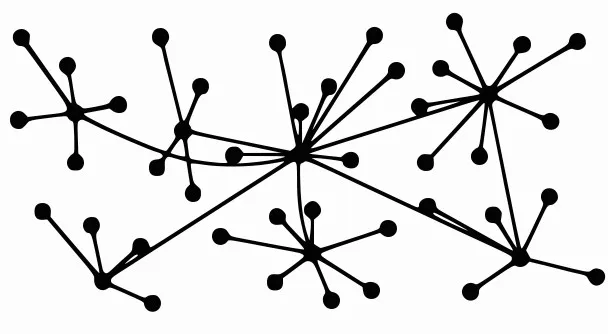

La storia di Internet com'era ieri, cos'è oggi e cosa può diventare la ritengo una introduzione per i prossimi articoli del blog e per capire anche il motivo dei miei progetti e della mia visione di un mondo digitale aperto.

## Cos'era Internet
Nasce negli anni '60 con il progetto **DARPA**, progetto del **Ministero della Difesa degli Stati Uniti**, come piccola rete interna. Intorno agli anni '70 si riescono a far comunicare i primi 4 computer, mentre si susseguono altre innovazioni fino agli anni '90 in cui nascono finalmente la prima versione del protocollo **HTTP** e il linguaggio **HTML**. Per i meno esperti rappresentano il linguaggio che ogni dispositivo usa per navigare nelle pagine dei siti web (HTTP), e queste pagine sono scritte con il linguaggio HTML. Nei decenni successivi sono avvenute altre evoluzioni ma il cuore del funzionamento non è cambiato molto. Un approfondimento completo lo trovate nella [Storia di Internet su Wikipedia](https://it.wikipedia.org/wiki/Storia_di_Internet).

In un [articolo su Wired](https://www.wired.it/internet/web/2019/03/11/internet-world-wide-web-storia/) c'è una cronistoria un po' più dettagliata con qualche video.

Internet era un insieme di utenti e servizi totalmente indipendenti e diffusi in rete e la possiamo rappresentare così:

I 2 principali inventori di quello che è il World Wide Web (WWW) sono [Tim Berners-Lee](https://it.wikipedia.org/wiki/Tim_Berners-Lee) e [Robert Cailliau](https://it.wikipedia.org/wiki/Robert_Cailliau).

L'idea di Tim Berners-Lee era di creare un'**Internet libera** dove ognuno potesse farne parte e potesse interagire con gli altri utenti. Inoltre nell'Internet del tempo era normale usare pseudonimi per cui si navigava in una certa forma di anonimato usando i famosi **nickname**. Non c'erano colossi che gestivano grandi siti web e piattaforme. L'anonimato in rete era normale perché dava determinate garanzie che non si potevano avere nella vita reale:
- potersi esprimere liberamente con altre persone senza avere ritorsioni personali
- poter denunciare e discutere di ingiustizie in modo sicuro anche se si vive sotto regime
- discutere apertamente dei propri problemi personali senza associarli a noi stessi
- esporsi in generale senza pregiudizi ed essere marchiati a vita

Ecco qualche dettaglio in più sull'anonimato descritto su Wikipedia con riferimenti anche a leggi che ancora oggi lo tutelano: https://it.wikipedia.org/wiki/Anonimato

Al tempo il famoso **cloud** non esisteva. Esistevano solo personal computer e server sparsi per le aziende. Eravamo agli albori.

## Cosa è oggi Internet
[Tim Berners-Lee ha dichiarato di recente](https://www.corrierecomunicazioni.it/protagonisti/lallarme-di-tim-berners-lee-web-a-rischio-troppo-potere-in-mano-a-google-e-facebook/) che il web oggi è in pericolo. Il motivo è che ci sono grossi colossi come Google e Facebook che hanno pervaso Internet con i loro servizi, senza che i governi avessero il tempo di capire il cambiamento e si rendessero conto che attori commerciali si stavano impossessando dello spazio su Internet, infatti oggi tutti gli aspetti della nostra vita sono influenzati da quello che accade in rete:
- le notizie le leggiamo da Internet
- discutiamo con le persone su Internet
- messaggiamo con servizi tramite Internet
- ci colleghiamo con le amministrazioni pubbliche e lo Stato tramite Internet
- lavoriamo con strumenti che sono collegati a Internet
- usiamo elettrodomestici, videocamere di sorveglianza e giochiamo tramite Internet

Se tutto questo spazio è gestito da pochi grossi colossi, chiamati in gergo **Big Tech**, la nostra libertà nel mondo digitale, quindi in qualsiasi ambito, sarebbe in pericolo. La rete Internet di oggi è centralizzata come in questa immagine:

La realtà è diventata complessa da gestire nel mondo di Internet. Internet è diventata una seconda vita che viaggia molto velocemente, infatti in pochi istanti possiamo parlare o vedere ciò che succede in qualsiasi parte del mondo, e oltretutto possiamo anche far parte di certi cambiamenti, basta vedere la recente **guerra in Ucraina** che tramite i social network la stiamo vivendo quasi in prima persona grazie ai contenuti che vengono pubblicati in zona di guerra. C'è da fidarsi però di tutto ciò che viene pubblicato? Chi pubblica tutto questo e che interessi ha?

Con l'arrivo dei **social network** la maggior parte delle persone ha iniziato a mettere il proprio nome e cognome in rete, a pubblicare foto e contenuti della propria vita privata, a stringere amicizie online e a riprodurre in rete la propria vita reale, oltre che a informare. Tutto questo ha vanificato i benefici dell'anonimato ma non ha fermato chi invece rimane anonimo per attività illegali e per diffondere notizie false o dirottare l'opinione pubblica perché siamo ormai influenzati per un buon 80-90% da quanto leggiamo online. Gli algoritmi delle Big Tech ci propongono contenuti cuciti su misura per noi perché sanno le nostre abitudini, siamo profilati perfettamente, e più navighiamo più diamo dati a questi colossi che, avendo in mano Internet tramite i loro servizi ci propongono sempre più pubblicità o contenuti personalizzati. Dove sta il problema? Che per quanto riguarda l'informazione **ci polarizziamo**, cioè veniamo condizionati e affamati con informazioni di cui siamo già convinti, e più vediamo contenuti personalizzati più pensiamo che quella sia la realtà perché ce l'abbiamo ogni secondo sotto il proprio naso.

Che fine ha fatto la curiosità di cercare notizie alternative?

Perché non possiamo uscire dalla propria bolla di credenze?

Se cerchiamo su Twitter, Facebook o YouTube notizie su Hitler, fascismo ed estrema destra, nelle ricerche successive vedremo tra i primi contenuti proposti da queste piattaforme gli stessi contenuti cuciti su misura, sempre di più, con la convinzione che esista solo questo o che quelle notizie siano "giuste" solo perché le vediamo continuamente e se ne parla, senza avere suggerimenti per notizie di orientamento opposto. Questa è anche una delle cause che porta al diffondersi delle **fake news**, perché abbiamo delle convinzioni e in rete non troviamo più delle risposte ma solo delle conferme alle proprie convinzioni e... udite udite... Internet è piena di notizie che confermano le proprie idee, anche se inesistenti o false!

## I rischi di questa evoluzione di Internet
Non ho molta fantasia nell'immaginare cosa Internet può diventare in futuro se non ci fossero stati e non ci saranno cambiamenti e regole importanti. Si sta centralizzando tutto dando troppo potere a singole aziende e singole piattaforme. Vi ricorda qualcosa l'accentramento di potere politicamente parlando? Si entrerebbe in una dittatura dell'informazione: le singole piattaforme tra cui social network (Facebook e Twitter), i motori di ricerca (Google), commercio elettronico e servizi web (Amazon) e software (Microsoft) hanno troppo potere, sia nel mondo digitale che di conseguenza anche al di fuori. Non voglio dire che il loro scopo iniziale fosse controllare il mondo digitale, ma nella pratica sta diventando così. E' anche vero che Mark Zuckerberg (Facebook) ha più volte ricordato ai governi di dare nuove norme per il web. D'altronde finché non ci sono regole più restrittive è assolutamente normale che Facebook e tutti gli altri big si spingano fino a dove la legge lo consente, perché un'azienda dovrebbe fermarsi e rinunciare ai propri ricavi auto-censurandosi e auto-limitandosi? Sarebbe un regalo alla concorrenza.

Perché le persone comuni non avvertono alcun rischio?

Perché non si ha la capacità di capire cosa questo può comportare nel lungo periodo e non è facile capire le dinamiche su come funziona la rete. Oltretutto sono servizi centralizzati, sono facilmente accessibili, all'interno troviamo la nostra cerchia di amici, perché sbattersi per cercare alternative? Sono tutti lì!

D'altronde il problema delle fake news che portano a distorcere la realtà sono proprio uno dei grossi problemi della società di oggi che arriva dalla rete, forse il problema più grande a mio avviso. Eppure la libertà di informazione che Internet ha portato dovrebbe dare accesso a più informazioni, a dati più completi e genuini, potendo così approfondire meglio la realtà... Magari!

I dati ci sono, ma è l'uomo il problema, perché non vuole approfondire. Quindi cosa facciamo, è una battaglia persa?

Ricorderò sempre quando avevo partecipato ad un evento per diffondere Linux e il software libero in un paesino dalle mie parti, non era stato pubblicizzato molto e infatti c'erano poche persone, circa una decina. Tra queste persone c'era anche un professore (forse di filosofia, non ricordo) che mi aveva interrotto durante la presentazione. Stavo infatti facendo notare che tramite Linux e il software libero ci si riprende il controllo sugli strumenti digitali e quindi c'è maggiore libertà di informazione, dando per scontato che la libertà di informazione fosse una cosa positiva. Proprio in questo punto mi aveva interrotto dicendo:

> Lo dici tu che è un bene la libertà di informazione... l'informazione aperta a tutti...

Subito non avevo afferrato cosa volesse dire perché non avevo mai messo in dubbio che la libertà di informazione fosse un traguardo positivo. Al che qualcuno in sala gli aveva chiesto spiegazioni e il suo esempio fu all'incirca questo:
> Ci sono Paesi del terzo mondo dove le persone non sono pronte a ricevere le informazioni. Paesi dove sapere tutto e subito si tradurrebbe in una rivolta seduta stante, perché non hanno l'istruzione adeguata per comprendere le informazioni e assimilarle.

E ancora:

> Il governo deve fare come un buon padre di famiglia che dà ai propri figli l'informazione un po' alla volta.

Non sono completamente d'accordo su questo paragone in quanto è comprensibile per un padre di famiglia, ma non vedo nei governi la stessa figura paternalistica che cresce un figlio, però da questa analisi ho capito una cosa: ancora oggi molte persone in Paesi democratici dove c'è un buon livello di istruzione non sono pronte a capire la realtà perché è complessa, e anche **su problemi complessi si cercano risposte semplici** che guarda caso confermano le proprie convinzioni. In una popolazione infelice c'è chi capisce che ci sono problemi che non dipendono dal proprio governo (vedi Covid, guerra e molto altro), e di solito queste persone sono coloro che non si fanno polarizzare, oppure sono polarizzate verso chi è al governo, mentre gli altri sono coloro che potrebbero fare delle rivolte come accennava il professore, solo che in questo caso non sarebbero sensate se fatte per cause futili ma solo perché alimentate da chi sparge falsa informazione, che uno scopo ce l'ha.

**Ci sono utenti che pubblicano decine e decine di post al giorno, sicuramente non hanno un lavoro... oppure è proprio quello il loro lavoro!**

D'altronde la rete alimenta e moltiplica questo fenomeno e non serve essere del Terzo Mondo per fraintendere o malcomprendere le notizie e farsi influenzare facilmente da una fazione.

Questo problema non si risolve identificando chiunque si connetta ad Internet e obbligandolo a registrarsi su una piattaforma con il proprio nome e cognome perché ci sono già molti politici che ci mettono la faccia e scrivono notizie manipolatorie, per cui non è l'anonimato il problema ma la notizia in sè. Anzi, come ho scritto sopra, l'anonimato potrebbe essere un buon metodo per evitare di farsi influenzare per cui si eviterebbe di credere a una notizia solo per il fatto che ci si fiderebbe di chi l'avesse scritta.

## Come Internet potrebbe diventare
Ogni piattaforma ha le sue regole e poi subentrano le leggi dello Stato in cui si vive. Di base le piattaforme più conosciute hanno delle norme abbastanza comuni, ad esempio sono vietati contenuti che riguardano **violenza**, **violazione del copyright**, **incitamento all'odio e alla violenza**. Supponiamo di essere Facebook. Le domande che mi farei sarebbero:
- come controllo tutto ciò che il miliardo di utenti scrive nella mia piattaforma?
- come posso moderare questi contenuti rispettando la religione, la conoscenza e la cultura Stato per Stato? In uno Stato può essere reato uccidere determinati animali mentre in altri no

Troppi dati da gestire e troppa poca trasparenza su come vengono gestiti, portando i moderatori di contenuti a [stress psicologico pesante come documenta Wired](https://www.wired.it/internet/social-network/2020/05/13/facebook-moderatori-contenuti-risarcimento/).

> Il vero potere oggi sono i dati e l'informazione, quindi chi li gestisce.

Chi gestisce i dati e l'informazione ha il potere di mostrare una notizia piuttosto che nasconderla. Attenzione: non sono le piattaforme che creano contenuti ma loro li gestiscono, mostrandoti quello che secondo i loro algoritmi sono più adatti a te e nascondendo o mettendo in secondo piano quelli che non lo sono. E tutto centralizzato in un unico punto da un'unica entità. Oppure su richiesta possono rimuoverli.

Come uscirne? Decentralizzando il web.

Credo che ad oggi non ci siano altre soluzioni. Gli strumenti e le piattaforme decentralizzate già esistono ma non hanno abbastanza visibilità, e chi può dar loro visibilità sono chi ha le spalle grosse come i governi, ma si può anche iniziare dal basso da comunità più piccole come un comune, una provincia, una regione o anche un'associazione. Questo per quanto riguarda i social network, mentre per altri tipi di strumenti utili a decentralizzare altri dati (email, messaggistica, documenti e altro ancora) ne parlerò in un altro articolo.

Ad oggi c'è una bellissima soluzione open source e decentralizzata che si chiama **[Mastodon](https://mastodon.it/)**.
C'è un bell'articolo sul [Corriere della Sera](https://www.corriere.it/tecnologia/22_aprile_27/mastodon-cos-e-come-funziona-l-anti-twitter-decentralizzato-open-source-e13fb542-c547-11ec-b657-ab502a045557.shtml).

A differenza di Facebook, Twitter o altre classiche piattaforme centralizzate, Mastodon è decentralizzata. Per fare un paragone con le immagini di prima, una Internet decentralizzata sarebbe rappresentata così:

Questo significa che invece di connettermi a _facebook.com_ o _twitter.com_ mi posso collegare a _mastodon.uno_, _sociale.network_, _livellosegreto.it_ e via così. Solo in Italia ci sono [15 istanze](https://mastodon.it/it/istanze-mastodon-italiane). Che cosa sono le istanze? Sono proprio 15 server diversi, ognuno a tema, gestito da 15 diverse entità e ognuna con le proprie regole. Questo significa che chi amministra ciascuna istanza è più vicino agli utenti che ne fanno parte e avrà una comunità inferiore da gestire, riuscendo quindi a gestirla meglio e capire le problematiche che possono segnalare i vari utenti al contrario di una grande piattaforma globale che tagli i post degli utenti con l'aiuto di algoritmi imperfetti. E inoltre i post non vengono mostrati in base alle proprie preferenze perché non si è profilati e infatti i post sono in ordine cronologico. Sono tutte istanze indipendenti e sfruttano un protocollo standard e aperto ([ActivityPub](https://it.wikipedia.org/wiki/ActivityPub)) che permette di vedere anche i post di altre istanze federate.

Qual è al momento il problema principale? La mancanza di profili altamente interessanti da seguire. Personaggi famosi e VIP preferiscono i classici social network perché sono già conosciuti e permettono di guadagnare mentre con Mastodon non ci sono pubblicità e non c'è modo di guadagnare. E' proprio una rete per gli utenti e fatta dagli utenti!
