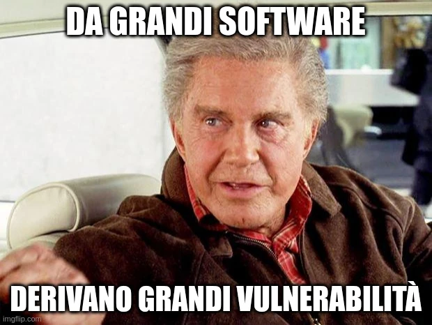

Sabato 22 ottobre 2022 [ho organizzato il Linux Day a Este](news/linux-day-2022-este). Avevo lanciato ad agosto un [nuovo gruppo Linux chiamato OpenIT Este](nuovo-gruppo-linux-e-iniziative) e ho pensato di approfittare per organizzare anche il Linux Day 2022 come hanno fatto circa altri 35 gruppi Linux in tutta Italia.

Essendo il gruppo ancora fresco ed essendoci la necessità di iniziare a dare il buon esempio ho organizzato quasi tutto da solo, con l'aiuto di un amico di vecchia data, **Andrea Bordin**, che ha sempre partecipato ad eventi simili in passato e che ha contribuito parlando di privacy, GDPR e temi sui diritti digitali nella prima presentazione, ma mi ha aiutato anche nelle altre 2 presentazioni aggiungendo dettagli e spezzando la mia monotona voce 😅

L'evento è andato bene. Le 3 presentazioni divise fra le 3 classi di informatica spero possano aver suscitato interesse almeno in alcuni. In questo momento storico secondo me c'è bisogno di **consapevolezza** negli strumenti digitali che usiamo, partendo dal software che dovrebbe essere **libero e aperto**, fino ai servizi in cloud che dovrebbero almeno rispettare il **GDPR** poiché è una normativa europea molto stringente e che ha colto i problemi di oggi e di domani sulla protezione e trattamento dei **nostri dati personali**.

> **La nostra vita digitale ha bisogno di usare strumenti digitali etici.**

Studenti di 16, 17 e 18 anni sono nell'età in cui stanno imparando le basi tecniche per il lavoro che andranno a svolgere nel loro futuro, e sono loro che sceglieranno se far vivere questa generazione, ma soprattutto le prossime, in un **mondo digitale libero, trasparente ed etico** oppure se farci vivere in un mondo digitale chiuso, dove i nostri dati personali sono semplice merce di scambio e dove ogni persona può essere profilata, sorvegliata e venduta (per modo di dire) solo per poter guadagnare o, peggio, per disinformare e controllare l'informazione. Come cita [**Monitora-PA**](https://monitora-pa.it/):

> viviamo in una società **cibernetica**
> 
> vogliamo che sia **democratica**

Si può vivere benissimo sviluppando strumenti digitali aperti, liberi ed etici, evitando quindi di usare le persone vendendo i loro dati come una merce qualsiasi. La scelta sta a chi inventa, propone, progetta, sviluppa, verifica e protegge il software.

L'IIS Euganeo è un istituto dove gli studenti delle classi di informatica potranno diventare consulenti informatici, project manager, sviluppatori di software, DPO ed esperti di cybersecurity, tema molto attuale. [In Italia c'è carenza di esperti in cybersecurity](https://www.guerredirete.it/cybersicurezza-italia-perche-non-si-trovano-candidati/).

Tenere un Linux Day in un luogo dove circa 60-70 ragazzi hanno partecipato è positivo e spero vivamente che almeno alcuni di loro possano essere sensibilizzati da queste presentazioni e possano magari partecipare a OpenIT Este per andare oltre!

Ringrazio quindi **Andrea Bordin** per l'aiuto nelle presentazioni, il mio ex-professore di informatica **Andrea Mion** per aver lavorato all'organizzazione dell'evento, il dirigente scolastico **Roberto Zanrè** dell'**IIS Euganeo** per aver accettato la proposta, tutti gli studenti che hanno partecipato e chiunque abbia contribuito a pubblicizzare l'evento.

[👉🏻 **SCARICA LE SLIDE DEL LINUX DAY 2022**](https://codeberg.org/loviuz/Presentazioni/src/branch/main/Linux%20Day%202022)
