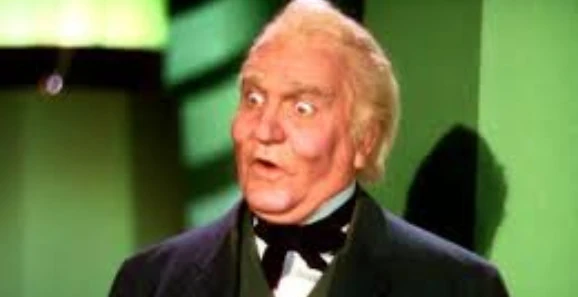
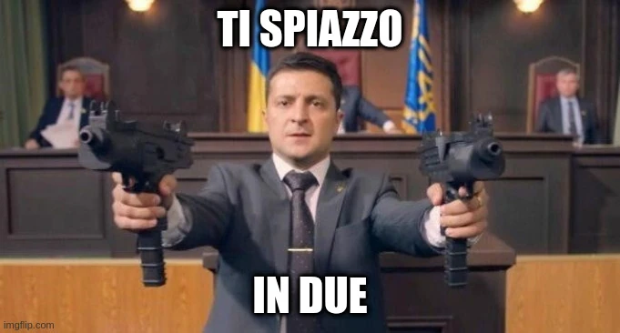
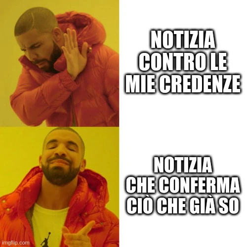
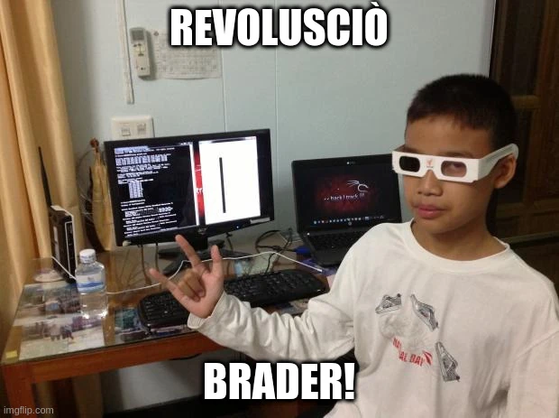
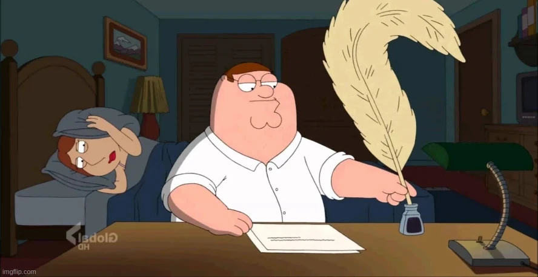

## Cosa sono le fake news?

Tradotto letteralmente significa **notizie false**. C'è chi le ha bollate così da diversi anni ormai e chiunque usa questo termine, anche in quantità spropositate. Esagerazione? No, è che sono veramente ovunque.

Banalmente, una notizia falsa è una notizia non vera, e detta così sembrerebbe facile riconoscere la realtà dalla falsità, ma non è così. Un esempio recente: è ormai un anno che la Russia ha avviato l'**invasione dell'Ucraina** e, così come in periodo Covid, il mondo sembra diviso in 2 schieramenti: pro o contro l'Ucraina, pro o contro i vaccini. Non ho studiato sociologia, geopolitica o filosofia, ma leggo di tanto in tanto qualche libro e testi ricchi di contenuti al contrario di brevi post su Internet dato che sono troppo riduttivi per informarsi, per cui un po' di base su questi temi me la sono costruita, e soprattutto mi sono fatto un'opinione su cosa sta accadendo. E ad ogni notizia o discussione che vi nasce attorno vedo che la mia teoria calza sempre.

## La realtà non esiste

Chi fa informazione ha un grande potere: creare un'opinione nelle persone. Già, perché tutto ciò che accade ogni giorno e viene raccontato in tv, nei giornali, per radio e su Internet, è un **riassunto** di un evento.

> Ogni evento ha delle conseguenze, che vengono moltiplicate quando viene raccontato.

Chi fa informazione fa quindi da **amplificatore** di un evento, un fatto. E i problemi iniziano subito qui, perché chi racconta un fatto può descriverlo (male) in vari modi:
- **omissione:** non vengono riportati dettagli importanti o essenziali per far comprendere a pieno la notizia
- **malafede:** i fatti vengono descritti in modo da porre eccessivamente in cattiva luce alcune parti, perché chi li descrive ha pregiudizi o opinioni negative su queste parti o le persone facenti parte della notizia
- **basato su altre notizie errate:** la notizia cita altre notizie che sono però errate, per cui nemmeno la notizia finale, che è un "derivato", non è corretta
- **inventata:** il caso peggiore, cioè quanto una notizia racconta un fatto che non è accaduto, quindi viene inventata di sana pianta. 

> L'informazione permette di comprendere la realtà e di operare le nostre scelte di conseguenza. Chi manipola l'informazione manipola la realtà e di conseguenza manipola le nostre scelte

Quando parliamo di informazione non intendiamo solamente il classico mainstream (tv, giornali, radio), ma anche tutto ciò che è digitale, quindi un post su **Facebook**, **Twitter**, **Mastodon** o qualsiasi altro luogo digitale, anche se non è un giornalista a scrivere la notizia ma una qualsiasi persona, anche questo stesso mio articolo che scrivo nel tempo libero. 

Questo articolo avrà su di te delle conseguenze: positive o negative, dipende da te, ma soprattutto dipende da me. Questo articolo ha lo scopo di trasmetterti il mio punto di vista sui rischi della cattiva informazione per creare dei meccanismi di difesa, ma avrei potuto dirti che le fake news sono derivanti da blog anonimi su Internet o da persone ben precise che stai seguendo, e che quindi dovresti ascoltare e fidarti dei telegiornali che sono più affidabili. In base a come avrei scritto questo articolo ti saresti fatto un'opinione diversa che avrebbe influenzato, anche in piccola parte, le tue scelte future. E il mio modo di scrivere questo articolo crea delle conseguenze diverse fra una persona e l'altra, sia che venga letto così come l'ho scritto, sia che lo avessi scritto in versione alternativa ("fidati solo dei telegiornali" ecc.).

Ma perché la notizia può avere conseguenze diverse da persona a persona?

Se la notizia ha conseguenze diverse, allora ci sono più realtà? Quindi la realtà è qualcosa di concreto o è una **percezione**?

> I fatti vengono raccontati in un modo ma vengo interpretati in più modi diversi e generano più conseguenze diverse.

Una **omissione** di un dato importante, un evento descritto in **malafede** e un collegamento ad **altre notizie errate** generano un mostro, altro che realtà!

A parte la mediocrità di chi scrive una notizia o la condivide senza cognizione di causa (sì, avete letto bene, ANCHE chi la condivide solamente, sui social o via messaggio ad amici sebbene non l'abbia scritta lui!), la cattiva informazione è pericolosa, soprattutto perché le notizie creano in noi delle opinioni che poi si trasformano in voto nella cabina elettorale, o scelte nella propria vita. E quasi sempre le notizie sono scritte per creare opinione, e non c'è l'opinione "giusta" ma c'è una chiave di lettura che ha inserito chi l'ha scritta.

## Un esempio pratico

Passiamo dalla teoria alla pratica con un esempio attuale: un giornalista che ritiene giusto far **sbarcare dei migranti** arrivati con un barcone perché rischiano di morire, ometterà nella notizia qualsiasi informazione che possa influire negativamente il suo messaggio, cioè che vanno salvati. Magari potrebbe omettere che uno di questi assomiglia ad un sospettato terrorista e lo omette perché "giustamente" non si è sicuri e se porta all'attenzione questo dubbio perde l'occasione di trasmettere il messaggio che gli immigrati arrivati con un barcone vanno salvati. Un giornalista che, al contrario, ritiene sia sbagliato farli sbarcare applicherà lo stesso metodo per costruire la notizia in modo che anche il lettore percepisca che è sbagliato far scendere i migranti, magari portando all'attenzione quel dubbio che uno dei migranti potrebbe essere un sospettato terrorista, magari accusando chi li vuole far sbarcare che questi "buonisti" sono incoscienti, o addirittura che quell'operazione di sbarco è stata creata ad arte per seminare il panico nel nostro Paese.

In questo caso vengono create 2 realtà, ma il fatto è uno: stanno sbarcando dei migranti. Nel mio esempio, il "buonista" omette un dettaglio per spingerti a farli sbarcare, il secondo invece ipotizza un rischio per NON farli sbarcare. Entrambi usano tecniche diverse ma per lo stesso scopo: spingere il lettore a crearsi un'opinione, la loro opinione, che è politica. Poi, che siano pagati per diffondere la loro opinione è un'altra cosa, ma sicuramente hanno una visione del mondo opposta l'un l'altro e uno dei 2 (se non entrambi) potrebbe scrivere ciò in malafede.

Su una notizia vera già è difficile capire cosa sta succedendo, figuriamoci quando una notizia è stata inventata! Il pericolo delle notizie inventate è che sono **realistiche**. Questo significa che chi inventa una notizia, se vuole essere credibile, deve dare una parvenza di realismo a ciò che sta scrivendo, quindi inserire dei fatti reali, magari distorcendoli a tal punto che si leghino perfettamente a ciò che sta inventando, altrimenti sarebbe poco credibile anche al suo pubblico.

## La prima chiave: il bias cognitivo

Viene definito **[bias cognitivo](https://it.wikipedia.org/wiki/Bias_cognitivo)** uno "schema" della memoria che non ci permette di essere obiettivi quando giudichiamo qualcuno o qualcosa. Non è qualcosa di assolutamente negativo, anzi, è visto come un'evoluzione della nostra memoria che ci permette di giudicare prendendo delle "scorciatoie" per necessità. Se fossimo in 10 in una stanza, e gli altri 9 effettuassero tutti la stessa scelta, nella maggioranza dei casi ci ritroveremmo anche noi a farla ma non perché l'abbiamo analizzata da cima a fondo ma per convenzione, basandoci su qualche spiegazione spiccia che alcuni di loro avrebbe usato per giustificare la scelta. A meno che la scelta non sia rischiosa in modo eclatante, la nostra mente accetta determinate scorciatoie.

Per capire il bias cognitivo applicato alle notizie, cioè la scorciatoia che intraprendiamo, ci basiamo su:
- **la nostra esperienza personale:** in mancanza di tempo, crediamo facilmente a una notizia che si avvicina di più a qualcosa che abbiamo già fatto, visto o pensato
- **la nostra cultura e le nostre credenze:** in mancanza di tempo, crediamo facilmente a una notizia se conforme alla nostra cultura o alle nostre credenze
- **il giudizio altrui:** in mancanza di tempo, crediamo facilmente a una notizia se questa viene accettata anche da chi ci sta intorno, per non apparire troppo "diversi"
- **schemi mentali:** in mancanza di tempo, si usano scorciatoie o metodi spicci per accettare una notizia, semplicemente basandoci su schemi che siamo soliti usare nella vita di tutti i giorni
- **paura di prendere una decisione che ci crei un danno:** in mancanza di tempo, se una notizia ci paventa un danno, non la accettiamo, soprattutto se la notizia demolisce uno dei nostri valori o credenze fondamentali, per cui, se si è poco auto-critici, piuttosto di mettere in dubbio le proprie credenze, si mette in dubbio la notizia che non le rispecchia
- **bias di ancoraggio:** quando si tratta una notizia di un argomento mai approfondito, la mente tende a dare più valore alla prima informazione che trova sull'argomento, indipendentemente che sia vera o meno, ma solo per il fatto che essendo stata trovata per prima le si dà più valore
- **bias di conferma:** in mancanza di tempo, tendiamo a credere più facilmente a notizie che confermano le nostre convinzioni

Il più pericoloso, secondo me, è il **bias di conferma**, perché polarizza le persone verso ciò in cui già credono. Una notizia viene presa per buona solo perché rientra tra le proprie convinzioni, altrimenti si avrà difficoltà a prenderla per buona. Un esempio classico: molte persone tendono a considerare i politici, almeno in Italia, dei ladri o corrotti, tutti, a prescindere. Se qualcuno scrivesse o condividesse la notizia (inventata) che il presidente della Repubblica Mattarella è indagato per evasione fiscale o per frode, subito questi creduloni la considererebbero vera, tra l'altro condividendola subito sui social network, ma non perché necessariamente lo sia ma solo perché è realistica e conferma il proprio pensiero, cioè che i politici sono ladri e corrotti, e probabilmente sarà vero se qualcuno lo ha scritto. In questo caso diventa pure meno importante chi lo scrive, potrebber averlo inventato un giornale che di solito non si legge di buon occhio perché contrario ai nostri bias di conferma ma in questo caso l'occasione per rimarcare le proprie convinzioni è così ghiotta che si condividerebbe pure un articolo di un giornale "nemico"!

## Usiamo la tecnica

Il tema della cattiva informazione, o informazione inventata, è talmente ampio e complesso che non basta un articolo di un blog per descrivere tutte le tecniche. Per fare un esempio, ci sono anche casi in cui si manipolano immagini o video, e il conflitto in Ucraina lo dimostra. In questo caso intervengono esperti di [OSINT](https://it.wikipedia.org/wiki/Open_Source_INTelligence) che sanno analizzare le fonti e i contenuti con un approccio tecnico, per smentire le falsità. Attenzione: NON sono opinionisti che giudicano, ma analizzano le immagini, i post in rete, i profili di utenti che condividono notizie in rete, e molto altro. Proprio per questo è un campo che mi affascina parecchio, perché è un metodo piuttosto certo per identificare notizie inventate o manipolate, perché si parla di dati e numeri riscontrabili. Si applica praticamente il metodo scientifico. Smentire una notizia inventata non permette di sapere tutta la verità, ma almeno di escludere i fatti inventati. Ricordiamo che un fatto, anche se inventato, potrà sempre essere usato da chiunque per avvalorare le sue tesi se questa notizia inventata verrà usata come fonte.

Non sono mancati in periodo di lockdown da **Covid**, ad esempio, canali Telegram o blog dove si inneggiava alla rivolta contro il **governo fascista** che ci obbligava a rimanere chiusi in casa quando, in altri Paesi, i cittadini stavano manifestando pesantemente contro i governi per mandarli a casa. Prendo questo esempio solo perché recente e non voglio portare le mie ragioni. Quanti non avrebbero voluto fare lo stesso in Italia? Ma poi, vedendo che in altri Paesi sta succedendo, perché non farlo anche noi? E invece no, perché quei video non sono reali. No?? Ma come, sono dei video, le riprese sono reali... Sì, le persone e il video è reale, sono persone che stanno protestando in piazza, ma... non per le restrizioni Covid. E' un'altra protesta di anni diversi di quelli della pandemia. Ce ne sono state parecchie, qui un [esempio della protesta di Rotterdam da BuTac.net](https://www.butac.it/proteste-rotterdam/).

Era sbagliato protestare contro il governo per le restrizioni in periodo Covid? Assolutamente no, liberi di farlo. Però fermiamoci un attimo a pensare al motivo della diffusione di una notizia simile. Se davvero ci fossero state proteste in ogni parte del mondo, almeno nella misura descritta da questi numerosi video, probabilmente la maggioranza dei cittadini era esasperata e i video di supporto avrebbero contribuito all'opinione che queste restrizioni erano giustificando che la protesta era giusta e mancavamo solo noi. Ma dal momento che parecchi video non centravano con le proteste Covid ma erano di anni diversi e in alcuni casi non erano neanche di quel Paese, a cosa serviva diffondere notizie inventate? Semplice: a creare una realtà diversa e **portare le persone a crearsi un'opinione**, l'opinione di chi quella notizia l'ha diffusa.

E quale obiettivo ha un giornalista o scrittore che scrive quella notizia e la dà in pasto ai social network? Si sta inventando le notizie di numerose rivolte nelle piazze perché è un giornalista mediocre e si è fatto fregare da un video falso che ha ricevuto da altri, quindi non l'ha verificato, oppure lo ha diffuso appositamente per foraggiare di motivi (falsi) chi la pensa come lui e quindi per aizzare la folla nel raggiungere uno scopo? Ma davvero vogliamo vivere con un'informazione che non ha contenuti validi e reali per giustificare le proprie idee e deve inventarle? Ma davvero? Se chi racconta notizie ha bisogno di queste notizie inventate, non vi viene il dubbio che, invece del governo, ci sia ogni tanto qualcun altro che vuole fregarvi?

## La mia opinione

Da un lato è pazzesco vivere in un mondo così, dove trovo leggerezza nell'accettare informazioni così deviate e manipolate. Sono spesso su Internet e derivano da persone o personaggi che per avere un po' più di visibilità pubblicano la qualunque, perché diciamocelo, per ricondividere una notizie che rinforza le nostre convinzioni si fa presto: si apre un motore di ricerca, si scrive la frase che cerchiamo e troviamo migliaia di siti che ne parlano, quindi la condividiamo subito. Avete fatto un bel lavoro? Siete contenti così? Si? Allora **vergognatevi**! Perché quando un giorno qualcuno si inventerà qualcosa su di voi per screditarvi e non avrete modo di difendervi, e oltretutto qualcuno crederà a quelle falsità su di voi, vi potreste rendere conto che lo avete fatto voi stessi per anni.

Non possiamo fare molto e non c'è una soluzione definitiva. Le persone credono alle notizie in base ai bias cognitivi, che da un lato permettono di apprendere più rapidamente, ma dall'altro lato **rischiano di non farci evolvere**, perché ci fermiamo ad approfondire tesi che già diamo per buone. Per farci veramente un'opinione dovremmo avere studiato la materia della quale si parla nella notizia. Ovviamente non tutti abbiamo le capacità e il tempo per farlo, per cui è assolutamente normale agire così.

> Servono dei giornalisti veramente trasparenti, onesti e auto-critici.

I social network sono uno strumento di amplificazione incredibile delle notizie, e quando sono false si amplifica l'effetto negativo che hanno sulle persone. L'aspetto peggiore che hanno i social network come Facebook, Instagram, Twitter, TikTok o altri che usano gli algoritmi per suggerire gli utenti sono proprio i loro algoritmi: invece di lasciare che l'utente visualizzi i post in ordine cronologico, generano un elenco di post a cui l'utente può essere più interessato, in base ai suoi like, commenti, visualizzazioni e quindi in base ai suoi gusti. Ovviamente, se Facebook mi mostra sempre post che rispecchiano i miei interessi, potrò mai ampliare le mie conoscenze? Ma soprattutto, la tipologia di notizie è viziata da ciò che leggiamo ogni giorno, per cui non possiamo essere obiettivi e fidarci sempre di ciò che ci propone il social network. Basti pensare che Facebook nel 2021 ha avuto un fatturato di 40 miliardi di dollari (fonte: [https://www.analisicorporate.net/facebook-bilancio-2021/](https://www.analisicorporate.net/facebook-bilancio-2021/)). Ho ricontrollato su più fonti, pensavo di aver letto male la fonte, ma sono 40 miliardi! 😱

**Vendono i nostri dati** e gestiscono queste piattaforme per tenerci incollati lì, quindi i contenuti che ci propone sono per forza di nostro interesse, altrimenti non useremmo questi social network.

Proprio per questo cerco di leggere poco in questi social network e uso piuttosto **Mastodon**, ho scritto a riguardo un articolo [qui](/news/perchè-entrare-su-mastodon).

## Vademecum

Come mi muovo quando leggo una notizia? Ecco cosa consiglio di fare:
- **E' SENSAZIONALE:** leggo la notizia e, se ha un tono sensazionalistico o suscita scalpore, prima di condividerla all'istante e fare il figo (subito, ma il *mona* dopo) cerca in rete una conferma o altri dettagli. Se non li trovi NON condividerla, o al massimo chiedi a qualcuno in privato se è vera, ma meglio non farla girare fin da subito perché qualcuno potrebbe prenderla per vera senza che sia verificata
- **FONTI:** verifica se la notizia ha delle fonti: solitamente un bravo giornalista riporta delle fonti. Se si stanno citando delle dichiarazioni di un personaggio importante, ad esempio un capo di Stato, sicuramente ci saranno moltissimi altri articoli che hanno riportato le stesse parole, potrebbero essere state modificate per dare un senso diverso. Se la fonte è un documento, un bravo giornalista dovrebbe riportare il link direttamente al documento ufficiale
- **NUMERI SCONVOLGENTI:** se si riportano dei numeri sconvolgenti (punto primo, sensazionalismo), occorre anche interpretarli. In molti casi sono stati dati numeri reali senza il giusto contesto. Paragonare dei dati di un determinato mese dell'anno rispetto allo stesso mese dell'anno prima, senza ulteriore contesto, può non essere un paragone valido. Anche qui, nel periodo del Covid, si paragonavano (vado a memoria) i contagi di settembre 2020 con settembre 2021, dopo aver iniziato la campagna vaccinale, evidenziando i contagi fossero aumentati pur avendo iniziato a vaccinare. Questo confronto non teneva conto che a settembre 2020 si stava uscendo da poco dalla prima fase di lockdown, mentre a settembre 2021 c'era un clima di fiducia per cui le persone sono uscite molto di più nei mesi prima e si sono contagiate per bene ora di settembre. Questo significa che i vaccini funzionano? Non è un dato utile per dirlo, ma sicuramente è utile dire che il confronto di 2 mesi dell'anno senza tutto il contesto attorno non è assolutamente un'analisi utile, e chi ci costruisce una verità sopra è in malafede
- **NON C'E' LA SPIEGAZIONE SEMPLICE:** se la spiegazione di qualcosa di complesso è semplice, molto probabilmente chi vi sta dando quella spiegazione l'ha semplificata e manipolata. Ogni argomento complesso ha spiegazioni complesse, e per quanto mi riguarda tendo a parlarne lasciando le porte aperte per approfondimenti e ulteriori dati o fonti, escludendo almeno le parti che sono palesemente e riscontrabilmente false
- **EDUCAZIONE:** non offendere chi non la pensa come te e vuole farti credere la sua versione fallata. C'è chi non è pronto al confronto e non lo vuole. Discuti pure, porta le tue ragioni e osservazioni, ma non scendere al suo livello. Ricorda che se anche stai discutendo con qualcuno che non si comporta civilmente in una discussione e non vuole ammettere le falsità, chi legge in modo neutro sa benissimo capire le tue ragioni, anche se non interviene direttamente.

Sono stato chiaro? Vi ho influenzati abbastanza con le mie opinioni? 😏
