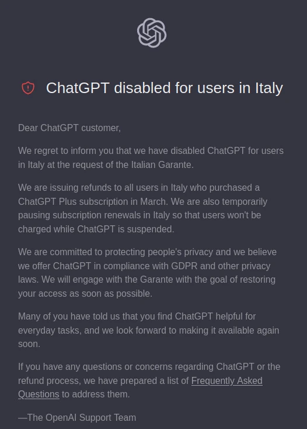

## Cosa è successo?

Giovedì 30 marzo 2023, il Garante per la protezione dei dati personali ha emanato un [provvedimento contro ChatGPT](https://www.garanteprivacy.it/home/docweb/-/docweb-display/docweb/9870847), il noto servizio di intelligenza artificiale che ha spopolato negli ultimi mesi, reso noto poi tramite comunicato stampa venerdì 31 marzo. Dal 31 marzo ChatGPT non è più accessibile dall'Italia.

Come molti sostengono, non è stato il garante o il governo a bloccare ChatGPT, ma è stata l'azienda stessa che ha posto il blocco per gli utenti italiani, comunque facilmente raggirabile tramite Tor, VPN o altri metodi.

## Cos'è ChatGPT in breve

Per chi ancora non lo sapesse, ChatGPT è un **chatbot** sviluppato da OpenAI debuttato a novembre 2022 per imitare le conversazioni umane e generare testo in modo automatico. A rendere speciale il modello progettato da **OpenAI LLC**, l'azienda statunitense ideatrice, è la sua capacità nel **creare testi comprensibili e soprattutto naturali per le persone**.

Per scrivere testo comprensibile e naturale, il suo algorimo è stato pre-addestrato utilizzando un'enormità di **dati pubblici** raccolti dalla rete. In rete sappiamo però che ci possono essere anche i nostri dati, quindi dati personali.

## Cosa c'entrano i dati personali?

Se non hai esposto i tuoi dati personali come preferenze politiche, numero di carta di credito o residenza c'è da stare tranquilli, quei dati ChatGPT non li può usare perché non sono pubblici.

**OpenAI LLC** tratta quindi i dati personali anche di cittadini residenti in Europa, per cui deve rispettare il [GDPR](https://it.wikipedia.org/wiki/Regolamento_generale_sulla_protezione_dei_dati), il Regolamento Generale sulla Protezione dei Dati. Analizzando la fonte dei dati che raccoglie troviamo **Common Crawl**, **WebText2**, **Books1**, **Books2** e **Wikipedia**, almeno per la versione 3 di ChatGPT ([fonte](https://it.wikipedia.org/wiki/GPT-3#Apprendimento_e_capacit%C3%A0)). Una volta analizzati questi dati li rielabora e li archivia con i suoi algoritmi e, fornita una domanda al chatbot, si ottiene una risposta piuttosto articolata.

Se chiedo chi è "Mario Rossi, il famoso politico degli anni 50" (domanda inventata), ChatGPT dovrebbe rispondere spiegando chi è in base ai dati che ha raccolto dalle fonti sopra citate. Esegue quindi un vero e proprio trattamento dei dati personali, oltre che un trattamento di altri dati che non sono personali e quindi non soggetti al GDPR, come la popolazione di una città, la dimensione di un edificio storico e altre informazioni generali di questo tipo.

## Perché ChatGPT sembra non rispettare il GDPR?

Di seguito riporto i punti più interessanti del provvedimento, con tanto di mia spiegazione e interpretazione, dopo aver letto in rete opinioni e pareri contrastanti. Questo articolo ho voluto scriverlo anche dopo aver ascoltato alcuni interventi del garante stesso, Matteo Flora ([primo intervento](https://piped.video/watch?v=EnGiAbwjtUE) e [secondo intervento](https://piped.video/watch?v=pZl7ailbUlE)) e aver discusso in modo più o meno acceso con altri "esperti" di IA in rete ("esperti" è una battuta).

> RILEVATO, da una verifica effettuata in merito, che non viene fornita alcuna informativa agli utenti, né agli interessati i cui dati sono stati raccolti da OpenAI, L.L.C. e trattati tramite il servizio di ChatGPT;

Quando si accede a ChatGPT non c'è alcuna informativa sulla privacy da accettare, ma si intende che sia automaticamente accettata. Per chi ha un proprio sito web sa che per rispettare la privacy degli utenti è obbligato a fornire un consenso informato ed esplicito verso gli utilizzatori del servizio. Nel sito di ChatGPT l'informativa è relegata ad un link a piè di pagina e non è neanche così tanto elaborata in proporzione all'abnorme trattamento dei dati che mette in pratica. Già qui manca un principio base, cioè esporre come verranno trattati e dati e chiederne l'accettazione.

**[Capo III, art. 12 - Informazioni, comunicazioni e modalità trasparenti per l'esercizio dei diritti dell'interessato](https://eur-lex.europa.eu/legal-content/IT/TXT/HTML/?uri=CELEX:32016R0679&from=IT#d1e2179-1-1)**

> RILEVATA l’assenza di idonea base giuridica in relazione alla raccolta dei dati personali e al loro trattamento per scopo di addestramento degli algoritmi sottesi al funzionamento di ChatGPT;

E' collegato al punto sopra, e specifica che non è stata specificata la **base giuridica** del trattamento dei dati personali, cioè non si specifica a quale scopo e per quale motivo vengono trattati. Indirettamente sappiamo che lo fa per addestrare gli algoritmi, ma non è specificato.

**[Capo III, art. 13 - Dati raccolti presso l'interessato](https://eur-lex.europa.eu/legal-content/IT/TXT/HTML/?uri=CELEX:32016R0679&from=IT#d1e2261-1-1)**

> RILEVATO che il trattamento di dati personali degli interessati risulta inesatto in quanto le informazioni fornite da ChatGPT non sempre corrispondono al dato reale;

ChatGPT tratta dati personali, rielaborandoli e fornendo nuovi contenuti generati in quel momento. Come dimostrato da [un video di Matteo Flora al minuto 4](https://piped.video/watch?v=pZl7ailbUlE&t=247), molte volte i dati rielaborati non sono corretti. Il garante della privacy non contesta il fatto che ci siano dati falsi o che ChatGPT generi fake news, ma semplicemente che fornisce dati personali errati. Nel video di esempio scrive che Matteo Flora è un ingegnere informatico (dato personale non vero), non ne permette la rettifica e non consente di ottenerne una serie di informazioni riguardo a essi. In particolare non risultano soddisfatti tutti questi requisiti dell'articolo 15 del GDPR:

**[Capo III, art. 15 - Diritto di accesso dell'interessato](https://eur-lex.europa.eu/legal-content/IT/TXT/HTML/?uri=CELEX:32016R0679&from=IT#d1e2520-1-1)**

> RILEVATO, inoltre, l’assenza di qualsivoglia verifica dell’età degli utenti in relazione al servizio ChatGPT che, secondo i termini pubblicati da OpenAI L.L.C., è riservato a soggetti che abbiano compiuto almeno 13 anni;
> 
> CONSIDERATO che l’assenza di filtri per i minori di età di 13 anni espone gli stessi a risposte assolutamente inidonee rispetto al grado di sviluppo e autoconsapevolezza degli stessi;

Il GDPR sancisce che i dati personali dei minori di 16 anni vanno trattati solo se il consenso è autorizzato da un genitore. Il limite di 16 anni può essere anche inferiore per ciascuno Stato membro, ma non inferiore a 13 anni. Durante la registrazione su ChatGPT, ad oggi, non c'è alcuna traccia di uno strumento per la verifica dell'età dell'utente che sta accedendo al servizio e che sta autorizzando, pur senza consenso, il trattamento dei suoi dati personali.

**[Capo II, art. 8 - Condizioni applicabili al consenso dei minori in relazione ai servizi della società dell'informazione](https://eur-lex.europa.eu/legal-content/IT/TXT/HTML/?uri=CELEX:32016R0679&from=IT#d1e2520-1-1)**

## Considerazioni su Privacy e IA

Devo essere sincero: all'uscita di ChatGPT non ho avuto particolari simpatie su questa tecnologia, almeno finché ne sentivo solo parlare. Quando l'ho provata sono rimasto particolarmente sorpreso per la semplicità e per tutto ciò a cui poteva rispondere, ma mi è sempre rimasto un alone di dubbio su cosa sarebbe potuta diventare e come si sarebbe evoluta, perché osservandola con un occhio critico fa anche un po' paura. D'altronde l'uomo, fin dalla notte dei tempi, ha sempre avuto paura di ciò che non conosceva.

Per gli **attivisti del software libero** poi, sapere che la tecnologia di ChatGPT è stata acquisita e integrata da Microsoft, accerrimo nemico del software libero fin dalla sua nascita, non è stata sicuramente una buona notizia.

Ciò che però rimane, al di là delle simpatie, è il rispetto dei diritti, in particolare il diritto alla privacy. Non me ne sono reso conto fin da subito, ma il garante per la protezione dei dati personali, che è tra gli organi che in Italia funziona a mio parere molto bene, ha sollevato le osservazioni spiegate sopra e ha perfettamente ragione.

Ho discusso molto in rete sull'argomento, talvolta con toni anche accesi, perché molte persone che sono programmatori o startup innovative se la stanno prendendo con il garante perché sta bloccando l'innovazione. Come per il pagamento delle tasse, il mio parere è che chi vuole intraprendere un lavoro deve conoscere le norme, valutare se è in grado di intraprendere un'attività rispettandole e, se la risposta è positiva, può proseguire. Le tecnologie che non rispettano determinate norme, purtroppo, non possono essere utilizzate. E' vero che questa decisione del garante non è uscita subito poiché i controlli non possono essere fatti immediatamente su tutte le aziende, oltretutto in un mondo globalizzato dove non si può controllare chiunque subito e immediatamente appena propone una nuova tecnologia sul mercato, ma dobbiamo farcene una ragione.

## Cosa succederà ora?
Ora OpenAI ha 20 giorni di tempo per fornire documentazione al garante della privacy che quei diritti vengono invece rispettati o deve perlomeno intervenire per rispettarli, pena una sanzione che può arrivare fino a 20 milioni di euro o al 4% del fatturato globale annuo. La vedo dura perché se li avesse potuti rispettare lo avrebbe fatto e, per come è strutturata la loro tecnologia, non la vedo di facile risoluzione. Di fatto, per essere a norma, dovrebbero:
1. inserire l'informativa privacy durante la registrazione: è la cosa più facile, basta integrare l'informativa privacy e inserire un box di conferma alla registrazione
2. inserire un controllo sul'età degli utenti che si iscrivono: non so come potrebbero fare, a mio parere è già un po' più difficile del punto 1
3. permettere all'utente di sapere come sono stati recuperati i dati personali, permetterne la rettifica e ottenere una serie di informazioni circa il loro trattamento (per quanto tempo vengono trattati, come vengono protetti, da chi, a quali aziende terze vengono dati, ecc), e questo punto, soprattutto la rettifica, lo vedo ancor più difficile degli altri 2 poiché immagino che il database di dati che sono stati raccolti automaticamente e gli algoritmi non siano predisposti per usare dei dati modificati. Non essendo un algoritmo aperto, libero e trasparente, possiamo solo fare ipotesi.

Cosa succederà veramente lo sapremo entro il 20 aprile!

Attendiamo anche che gli altri garanti della privacy di altri Stati europei prendano lo stesso provvedimento, o probabilmente attenderanno l'esito in Italia per conformarsi se è il caso.

Se hai suggerimenti, critiche o errori da segnalare nell'articolo puoi farlo tramite il canale Telegram: https://t.me/cybermind_blog