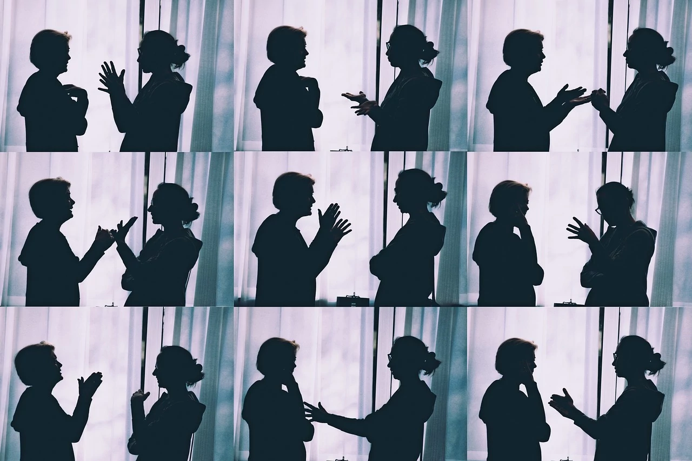

## Una domenica normale può cambiare la vita

Non sono un cattolico praticante in modo costante. Sicuramente tra chi mi leggerà ci sarà anche chi ha idee opposte, cioè che non c'è nulla da celebrare e che non esiste nulla di ciò che si parla in una Chiesa, lo so, ci sono atei convinti e rispetto le idee di tutte le persone, ma non è questo il tema di oggi. Per me, l'omelia è la parte importante di una celebrazione perché permette alle persone di ascoltare la parola del sacerdote e lo pone su un livello diverso, in linea con le persone comuni diciamo, poiché commenta le letture del giorno a modo suo, e si esprime con tutta la sua umanità e naturalezza. L'omelia e la sua capacità di interpretarla ed esprimerla legandola al presente è uno degli aspetti che avvicina le persone.

## Abbiamo già tutte le risposte

Oggi il Vangelo parlava della testimonianza di Giovanni, la trovate [qui su chiesacattolica.it alla voce Vangelo](https://www.chiesacattolica.it/liturgia-del-giorno/?data-liturgia=20231217).

Non voglio soffermarmi sulla lettura in sè ma sull'omelia, quando il parroco **on Eros**, al [Duomo Santa Tecla in provincia di Padova](https://www.duomoeste.it/), ha portato all'attenzione un fatto: oggi, **siamo ancora in grado di farci delle domande**? Troviamo facilmente risposte, a volte anche banali e facili, ma a quale domanda? Ha poi incalzato sulla tecnologia, dove troviamo facilmente di tutto... ma in risposta a cosa? La cosiddetta "intelligenza artificiale" (IA) dà risposte, ma a quali domande? Accettiamo volentieri risposte da una macchina? Per chi non lo sapesse non c'è nulla di intelligente nella IA, ma a una domanda vengono messe insieme parole che formano una frase grammaticalmente corretta, ma per la macchina non ha alcun senso, però riesce a metterle insieme bene.

## A quali domande?

Mentre ne parlava io ci pensavo, e la prima cosa che viene in mente potrebbe essere "beh, ma se io cerco qualcosa è ovvio che quella è la mia domanda, e un motore di ricerca su internet (per esempio Google) mi dà la risposta". Ni. Prima di tutto: è veramente la domanda giusta? Secondo: la risposta che otteniamo è la risposta giusta?

Ora, se entriamo in cosa è "giusto" o "sbagliato" è il dilemma di sempre, non ne veniamo facilmente a capo, quindi proviamo a concentrarci su un altro aspetto.

Provo a elaborare dei casi pratici, e spero di aver interpretato bene: se cerco un telefono nuovo una volta all'anno, per avere l'ultimo modello, su internet troverò la risposta, cioè tanti bei telefoni, ultimo modello, magari anche in offerta. Perché devo cercare un telefono nuovo quando questo funziona? Perché ho i soldi per farlo e non mi cambia la vita economicamente parlando. Sto cercando un telefono nuovo o un bene che mi permette di sentirmi realizzato? Oppure di sentirmi incluso nella società delle persone di un certo livello? Sto facendo la scelta giusta? Se cerco di vivere in modo più sostenibile e rispettare l'ambiente , è un bene che io cambi telefono, facendo sprecare materie prime inutilmente, facendo spostare mezzi per il trasporto di queste e del prodotto finale?

Insomma, questo può essere un esempio di domanda sbagliata.

> Non puoi avere la risposta giusta da una domanda sbagliata.

Un altro aspetto che ho colto è che tutto è diventato **veloce**, e probabilmente anche questo fattore fa commettere errori, tra cui farsi la domanda sbagliata. Se compro frequentemente un telefono nuovo, considerando che l'errore non sarà solo mio ma di altri milioni di persone che fanno come me, il "danno" di una domanda e conseguente risposta sbagliata inizierà a diventare importante. Soprattutto, a livello umano, il problema di sentirsi soli e quindi cercare uno strumento sempre nuovo e all'avanguardia per essere inclusi socialmente può portare a non risolvere il problema della solitudine (domanda e risposta sbagliati).

*Foto di [12138562O](https://pixabay.com/it/users/12138562o-12138562/?utm_source=link-attribution&utm_medium=referral&utm_campaign=image&utm_content=7059924) da [Pixabay](https://pixabay.com/it//?utm_source=link-attribution&utm_medium=referral&utm_campaign=image&utm_content=7059924)*

> La fretta di avere risposte facili e immediate allontana le persone che non riescono più a porsi domande e confrontarsi. Le domande difficili hanno risposte difficili che vanno trovate attraverso un lungo percorso, con confronti e pazienza

## Il ruolo della tecnologia

Ho parlato di solitudine come un normale esempio, ma credo che sia anche uno dei problemi più frequenti. Forse non solo la solitudine ma la noia e la socialità in calo: vedo molte persone chiuse in sè stesse, casa-lavoro-casa, giorno dopo giorno. C'è il piatto caldo, il lavoro, si mette via qualche soldo, e gli altri che si arrangino. Tanto, nei tempi morti si mette la mano in tasca, si prende il telefono, si cercano notifiche: se nessuno ha scritto, si apre qualche applicazione a caso ed ecco che i social network commerciali scelgono per te cosa devi guardare, magari ci strappano anche qualche sorriso, nell'indifferenza di tutto ciò che succede attorno nel mondo reale e a noi stessi. Il risultato finale è che non c'è mai tempo per fare altro, certo, perché si cerca sempre qualcosa ma non si sa cosa. E' qui che mancano le domande ma si cercano... risposte.

> Non abbiamo domande, ma solo risposte

In questo modo smettiamo di essere **protagonisti della propria vita** e ci lasciamo trascinare da questi automatismi e algoritmi dei social network che catturano la nostra attenzione, ma il problema va poi oltre perché ne diventiamo dipendenti e ci condizionano anche oltre questi ritagli di tempo libero.

Le nuove generazioni iniziano ad usare questi dispositivi e internet senza una conoscenza di base, i genitori magari ancora meno, la scuola non li forma per tempo e si trovano quindi a subire algoritmi e logiche commerciali di queste applicazioni che **sfruttano ogni frammento della nostra attenzione** per profilare e influenzare, a discapito di una sana informazione e confronto quando avviene in rete, poiché anche qui si possono fare domande e confrontarsi se ci si pone nel modo giusto. Si sa che gli adolescenti sono la fascia più debole e va protetta da tutto questo, per **non diventare dipendenti dalla tecnologia che toglie tempo alla vita vera e alle domande**.

*Foto di [Kirill Averianov](https://pixabay.com/it/users/averyanovphoto-12664159/?utm_source=link-attribution&utm_medium=referral&utm_campaign=image&utm_content=4246954) da [Pixabay](https://pixabay.com/it//?utm_source=link-attribution&utm_medium=referral&utm_campaign=image&utm_content=4246954)*

> Regaliamo la nostra attenzione e il nostro tempo, perdendo attimi importanti della nostra vita in cui potremmo fare altro, anche solo a farci vere domande

Non parliamo poi della **disinformazione (fake news)** che, in questo modo, dilaga, anche se pensate che sia sempre qualcosa che non vi toccherà mai. Ne ho parlato in un altro [mio articolo sulle fake news](/news/fake-news/).

## Cosa possiamo fare

Se dicessi di avere le risposte giuste sarebbe un controsenso...!

I consigli che mi sento di dare sono:
- ogni tanto, nel silenzio, **fermati a pensare alle cose più banali** che fai e chiediti perché le fai
- mentre chiacchieri con delle persone, **chiedi a chi ti sta di fronte il perché di ogni cosa** che ti dice, potrebbe nascerne una discussione esistenziale interessante
- come me, ma a livello di telefono personale, togli le notifiche e aprilo solo quando devi cercare qualcosa. In quel momento troverai anche dei messaggi. Se devi organizzarti per trovarti con delle persone, ovviamente, va bene guardarlo qualche volta in più a ridosso dell'incontro se vi dovete scambiare qualche messaggio in più per coordinarvi
- se proprio vogliamo usare un social network che non ci rubi l'attenzione e il tempo sfruttando i nostri dati e le nostre abitudini, converrebbe provare **Mastodon**. Ho spiegato cos'è in un altro [mio articolo su Mastodon](/news/perchè-entrare-su-mastodon/)

*La foto di copertina è di [Pexels](https://pixabay.com/it/users/pexels-2286921/?utm_source=link-attribution&utm_medium=referral&utm_campaign=image&utm_content=1868530)</a> da [Pixabay](https://pixabay.com/it//?utm_source=link-attribution&utm_medium=referral&utm_campaign=image&utm_content=1868530)*