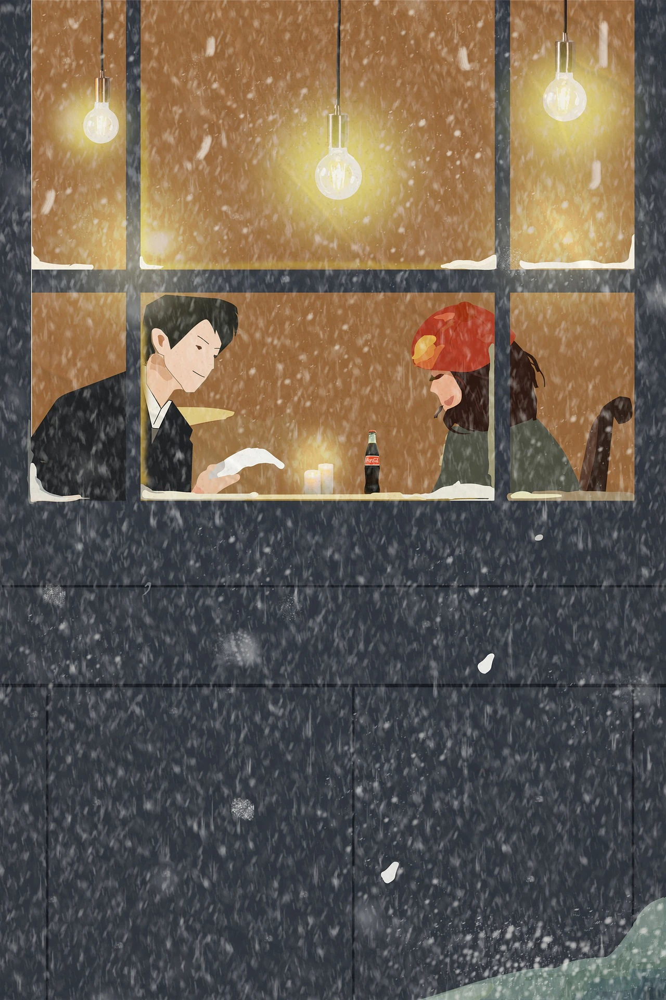

## 🛒 Niente regali

Prima di scrivere questo articolo ho pensato: ma non l'avevo già scritto l'anno scorso? In effetti sì, eccolo qui: [A Natale fai un regalo che non ha prezzo](/news/natale-consumismo/).

Lo scorso anno avevo suggerito di **non fare regali materiali** poiché generano solo nuovi rifiuti e poi, diciamocelo: abbiamo già un po' di tutto, tanto che a volte rischiamo di inciampare in casa su qualcosa che non si usa da anni, o ci mettiamo più o meno sempre i soliti vestiti. Su 10 felpe usiamo sempre quelle 4-5. Mi sto sbagliando?

Ma quest'anno cosa c'è di diverso oltre al consumismo? Seguimi perché c'è un ragionamento e ci arriviamo insieme alla fine.

## Riflessioni

Oggi viviamo in un'era in cui tutto è breve, veloce, istantaneo, costa poca fatica, otteniamo continuamente piccole ricompense (un messaggio con la faccina felice, un cuoricino sui social), ma in fondo sembra manchi qualcosa. Dedichiamo tanto di quel tempo al telefono a leggere, commentare, mandare messaggi, apprezzamenti... eppure non abbiamo il tempo di stare con le persone più di 20 secondi.

Quella cosa che manca è la **profondità**. Faccio un esempio:
- leggo delle notizie sui social » mi sto informando
- mando continuamente messaggi ad amici e familiari » sto comunicando
- lavoro tanto e continuamente » sto facendo qualcosa di utile
- faccio un regalo » sto facendo qualcosa di buono

Rimane sempre, però, un "retrogusto" strano... sembra come di non aver concluso niente o di non essere appagati, o di non fare abbastanza:
- quando entro in una discussione di attualità non mi sento ben informato, non so approfondire e quindi non riesco a rispondere in modo puntuale
- vedo amici e familiari 2 volte l'anno e non ricordo che lavoro fa lo zio o se era in pensione (aspetta, ma è zio o cugino di secondo grado??)
- mi domando cosa ho realizzato di utile al mondo con il mio lavoro ma ricordo (forse) solo l'ultima rogna di ieri
- mi sembra di regalare sempre le stesse cose o che i regali siano uno strano circolo vizioso da cui non si riesce a uscire

## Il punto

Stiamo facendo tante piccole cose perché sono le nostre abitudini quotidiane, oppure nel caso dei regali sono abitudini che si ripetono nelle solite festività. Fra 5 anni ci ricorderemo veramente di tutti i regali ricevuti e dati? Ce ne sono di così importanti che ci hanno lasciato il segno? Prova a fermarti e pensaci, seriamente:

> negli ultimi 5 anni, che regalo hai ricevuto che ti ha lasciato il segno? 🧐

## Il mio punto di vista

Non è che i regali materiali ormai non abbiano più molto senso?

Sono sincero: dei regali materiali mi sto stancando. Uno dei motivi è che stiamo veramente sprecando troppo, e di questo ho scritto sull'articolo del Natale scorso. Penso che accetterei probabilmente un bel libro, però ho gusti difficili, quindi non vorrei trovarmi a casa un libro che non mi interessa. Ne ho già qualcuno, purtroppo, che non rispecchiava le mie aspettative e non mi prendeva, quindi non l'ho più terminato, però i libri si possono anche dare ad altre persone o scambiare. Al contrario, quelli giusti, lasciano il segno e ci fanno crescere.

## Luoghi comuni
- "_troppo snob: lui ha già tutto e gli fa schifo ricevere i regali"._ (🤦 sbagliato)
- "_vuole fare il diverso per farsi notare._" (😐 non ho mai cercato visibilità, e chi mi conosce lo sa bene)
- "_non vuole regali perché è una scusa per non impegnarsi a farli alle altre persone_." (no, anche perché quello che propongo è più impegnativo!)

🙏 Veramente: non mi regalare niente di materiale. Le uniche cose che accetto sono quello che scriverò qui sotto. Se metteremo in pratica qualcosa, scoprirai che a volte basta un pensiero (e non per forza a Natale) e che a me basterebbero dei fogli bianchi e delle matite per esprimere creatività (ora non regalarmeli perché li ho già presi un mese fa per me, era solo un esempio 😆).

E non cercare a tutti i costi di regalare qualcosa di materiale che sia diverso dal solito solo perché "a Natale bisogna pure regalare qualcosa", oppure per dare l'idea che hai letto l'articolo (magari a metà) pensando quest'anno di cambiare solamente il "cosa" regalare. Per capire devi leggere fino in fondo.

## Che cosa vorrei

Quest'anno vorrei che le persone si regalassero **✈️ esperienze**, **⏳ tempo** e **💜 profondità**.

### ✈️ Esperienza

*Foto di [valeska salgado](://pixabay.com/it/users/vsalgado23-2226024/?utm_source=link-attribution&utm_medium=referral&utm_campaign=image&utm_content=1259608) da [Pixabay](https://pixabay.com/it//?utm_source=link-attribution&utm_medium=referral&utm_campaign=image&utm_content=1259608)*

Un viaggio, un gioco o qualsiasi altra cosa che possa essere vissuta insieme. Racchiude sia il tempo che la profondità. Il tempo che si sta insieme, se usato bene, permette di scoprire qualcosa di profondo e autentico. Prova a pensare alla differenza tra un albero ben piantato a terra da decenni rispetto a una piantina appoggiata a terra da poco.

### ⏳ Tempo

*Foto di [nini kvaratskhelia](https://pixabay.com/it/users/ninikvaratskhelia_-15913392/?utm_source=link-attribution&utm_medium=referral&utm_campaign=image&utm_content=6781983) da [Pixabay](https://pixabay.com/it//?utm_source=link-attribution&utm_medium=referral&utm_campaign=image&utm_content=6781983)*

Tempo e qualità: non un paio d'ore per farsi gli auguri al bar o da parenti e poi rivedersi fra 6 mesi, ma almeno una mezza giornata o una giornata intera. Qualche ora è troppo poco per riscoprire la profondità di una relazione. I telefoni, in questi casi, dovrebbero rimanere la maggior parte del tempo in tasca.

Normalmente, in un primo momento ci si saluta, si fanno gli auguri e poi ci si scambiano i regali, con i sorrisi e le frasi di rito. Andrebbero, innanzitutto, tolte le maschere subito dopo i giubbotti.

### 💜 Profondità

*Foto di [Mohamed Hassan](https://pixabay.com/it/users/mohamed_hassan-5229782/?utm_source=link-attribution&utm_medium=referral&utm_campaign=image&utm_content=6994374) da [Pixabay](https://pixabay.com/it//?utm_source=link-attribution&utm_medium=referral&utm_campaign=image&utm_content=6994374)*

La profondità è parlarsi apertamente, approfondire, condividere senza pregiudizio. Non avere paura di farsi domande che possono sembrare scomode, entrare anche nell'intimità se è il caso, rendersi disponibili a dare un consiglio o un aiuto, porsi in modo positivo o costruttivo.

> “Non è la quantità di attività che ci travolge, ma la mancanza di senso.”
> — Viktor Frankl

## Conclusione
Questo mio pensiero potrebbe non piacere, però è questo. Con il tempo si cambia, ci si trasforma, così come il mondo intorno a noi. Potrei aver fatto o detto il contrario molto tempo fa e oggi potrei aver capito alcune cose che non capivo allora. D'altronde conoscerci, dedicare tempo e profondità, magari sfruttando delle esperienze insieme, potrebbe rendere il mondo un po' più interessante, no? 😀

Buon Natale! 🎄

PS: se anche tu la pensi in questo modo, condividi l'articolo per iniziare un cambiamento!

*La foto di copertina è di [Jason Goh](https://pixabay.com/it/users/cegoh-94852/?utm_source=link-attribution&utm_medium=referral&utm_campaign=image&utm_content=564351) da [Pixabay](https://pixabay.com/it//?utm_source=link-attribution&utm_medium=referral&utm_campaign=image&utm_content=564351)*