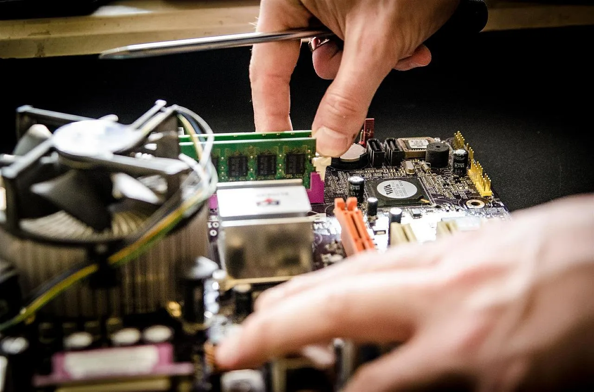
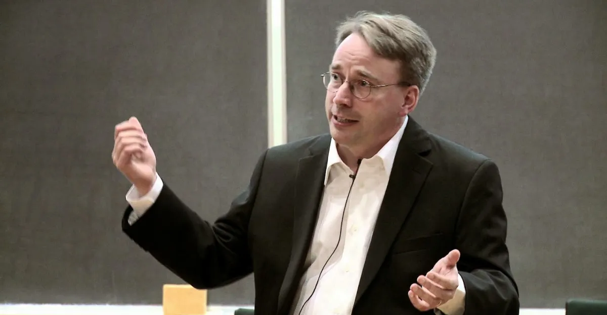

## Intro
Perché questo articolo? Può sembrare ripetitivo o pesante, però negli anni mi sono trovato a spiegare cos'è il software libero e il software open source, e ogni tanto mi trovo a rispondere alla stessa domanda o a rispondere a critiche verso questo modo di pensare. Ecco perché ho pensato di scrivere un articolo completo e definitivo (o quasi), così al prossimo che me lo chiede risponderò "trovi una risposta esaustiva nel mio blog" 😁

## Le basi
Tutti noi utilizziamo ormai almeno uno tra questi dispositivi: smartphone, pc, tablet, smart TV, smartwatch e molto altro ancora. Oppure usiamo indirettamente altri dispositivi elettronici come la centralina dell'auto, il router di casa, una videocamera di sorveglianza, l'allarme e via così. Ma vi siete mai chiesti come fanno a funzionare?

Questi dispositivi sono un insieme di componenti elettrici ed elettronici (detto **HARDWARE**) tra cui anche un processore, ossia un componente principale che permette di dialogare con gli altri componenti; alcuni sono più semplici e altri più complessi come un computer o uno smartphone. Questi pezzi di "metalli e fili" non sarebbero utili come lo sono oggi senza un **SOFTWARE**, cioè delle istruzioni su come tutti questi componenti devono funzionare tra di loro, ad esempio mostrando delle scritte a video, farci scrivere un testo attraverso una tastiera e inviarlo ad un amico oppure per permettere di scattare foto e di archiviarle.

Vi viene in mente qualcosa che non sia elettronico? Forse un tavolo e una sedia! Ormai siamo avvolti dall'elettronica e quindi dal software che la governa.

> Immagina come se l'hardware fosse il corpo umano e il software fosse il cervello che lo comanda: un cervello senza corpo farebbe poco, così come un corpo senza cervello non si muoverebbe.

**Software open source** in italiano significa **software a codice sorgente aperto**.

Cos'è quindi il codice sorgente? E' come la ricetta di una torta: tu puoi mangiare una torta, assaporarla, vederla, toccarla, ma se non hai la ricetta originale difficilmente sarai in grado di riprodurla uguale o di sapere se gli ingredienti ti possono creare problemi. Il codice sorgente di un software è la ricetta con cui far funzionare un dispositivo. Il codice sorgente è scritto da un umano in un linguaggio comprensibile per l'uomo, e per essere caricato nel dispositivo deve essere convertito in un linguaggio comprensibile per la macchina, nel gergo deve essere **compilato** per la macchina, per cui viene trasformato in un altro formato meno leggibile dall'uomo.

Una precisazione importante: per avere la certezza assoluta che il software presente nel dispositivo usato faccia ciò che è scritto nel codice sorgente, definito da un umano, bisogna assicurarsi che sia stato caricato esattamente quel codice. Non potendo verificare noi direttamente il codice sorgente di tutto il software usato nei dispositivi che usiamo, e non potendo compilarlo direttamente e caricarlo sul dispositivo ad ogni aggiornamento, si possono usare altri metodi un po' più complessi, ma viene in aiuto anche una certa forma di fiducia globale: se una società dichiara di usare un determinato software open source nei propri dispositivi, per esserne sicuri al 100% bisognerebbe verificare il codice sorgente che dichiarano di usare e che compilano poi nel linguaggio macchina, e che infine viene caricato nel dispositivo.

Molti hacker e smanettoni cercano spesso di **indagare** se qualche dispositivo dichiaratamente open source contenga veramente la versione originale del software dichiarato. In certi casi si possono trovare dei software modificati in grado di far accedere terzi al nostro dispositivo senza il nostro consenso tramite una **backdoor**, ossia tramite "una porta nel retro", un metodo per accedere abusivamente ai nostri dati e al nostro dispositivo. L'inserimento di queste backdoor si scopre tramite il **reverse engineering**, cioè la pratica di capire cosa possa fare il codice partendo dal linguaggio macchina, quindi seguendo il processo al contrario, cosa molto difficile ma che in alcuni casi è servita a smascherare software e dispositivi spia o modificati. Fa pensare il fatto che alcuni Stati vogliano rendere illegale il reverse engineering con la scusa della violazione del diritto d'autore (il reverse engineering si può fare anche su software closed source)... forse per non farci scoprire software modificati da enti governativi per spiarci? Il libro di Edward Snowden ci insegna che ciò è già successo, non è un'idea di complotto e purtroppo succede ancora troppo spesso sia da enti governativi che da aziende private o da criminali informatici.

La torta è il risultato finale. La ricetta sono le istruzioni su come comporla.
Se non hai il codice sorgente di un software puoi fare reverse engineering scoprendo magari che ci sono delle fragole per cui puoi dedurre che sono tra gli ingredienti. Alcuni Stati potrebbero vietarti di indagare come è fatta. Non è il massimo, vero?

## Come è nato
Senza ripercorrere la storia intera rimando a Wikipedia in cui è spiegata più che bene e in modo ampio: [Open Source su Wikipedia](https://it.wikipedia.org/wiki/Open_source).

Riassumendo brevemente: il software è sempre stato condiviso dagli albori con il codice sorgente, quindi open source, ma intorno agli anni '80 molte software house (aziende che sviluppano software) iniziarono a diffondere software senza più il codice sorgente (detto anche **closed source**) e il padre fondatore del movimento open source **Richard Stallman** iniziò una battaglia grazie alla quale oggi possiamo vivere in un mondo dove il software open source è diffuso e ci garantisce determinate libertà.

> Per fare un paragone: è grazie a Richard Stallman se oggi abbiamo il diritto di poter mangiare delle torte sapendo cosa c'è dentro e potendole così rifare da soli, rifarle in versione diversa, studiare cosa c'è dentro e condividerle con gli altri. Immaginate di vivere in un mondo dove ogni cosa che mangiate non esponga la lista degli ingredienti.

.webp)

Non ha inventato il metodo di creare software a codice aperto ma ha lottato affinché le persone avessero la possibilità di creare software con 4 libertà fondamentali:
- **libertà 0:** libertà di eseguire il programma per qualsiasi scopo. La libertà di usare un programma significa libertà per qualsiasi tipo di persona od organizzazione di utilizzarlo su qualsiasi tipo di sistema informatico, per qualsiasi tipo di attività e senza dover successivamente comunicare con lo sviluppatore o con qualche altra entità specifica. Quello che conta per questa libertà è lo scopo dell'utente, non dello sviluppatore; come utenti potete eseguire il programma per i vostri scopi; se lo ridistribuite a qualcun altro, egli è libero di eseguirlo per i propri scopi, ma non potete imporgli i vostri scopi;
- **libertà 1:** libertà di studiare come funziona il programma e di modificarlo in base alle proprie necessità. L'accesso al codice sorgente è una condizione necessaria per il software libero, altrimenti non avrebbero senso neanche la libertà 0 e la 2;
- **libertà 2:** libertà di ridistribuire copie del programma in modo da aiutare il prossimo;
- **libertà 3:** libertà di migliorare il programma e di distribuirne pubblicamente i miglioramenti, in modo tale che tutta la comunità ne tragga beneficio.

Richard Stallman ha ideato il movimento del software libero che si concentra non solo sull'aspetto pratico di fornire software con codice aperto a tutti ma di avere queste ulteriori libertà che vanno oltre.

## Il progetto GNU/Linux
Tra i progetti più importanti al tempo ci fu **[GNU/Linux](https://it.wikipedia.org/wiki/Linux)**. Richard Stallman iniziò la battaglia con l'obiettivo di arrivare a creare un sistema operativo completamente libero, che seguisse quindi questa filosofia. Ideò una serie di software open source ma gli mancava il cuore del sistema operativo, il cosiddetto **kernel**, che serve a far funzionare tra di loro mouse, tastiera, schermo e qualsiasi altro dispositivo connesso. Senza il kernel open source poteva far funzionare i suoi software su un sistema operativo closed source, come ad esempio Windows, Unix o Mac.

Il kernel open source fu ideato a inizio anni '90 da uno studente finlandese chiamato **[Linus Torvalds](https://it.wikipedia.org/wiki/Linus_Torvalds)**.

L'accoppiata del progetto GNU e il kernel Linux ha dato vita alle [distribuzioni **GNU/Linux**](https://it.wikipedia.org/wiki/Distribuzione_Linux), una serie di pacchetti completi di sistema operativo + software per poter usare il proprio computer utilizzando solo software open source e libero!

Spesso si parla erroneamente di Linux, ma il sistema operativo completo di applicazioni si chiama GNU/Linux.

Le distribuzioni GNU/Linux sono tantissime e dedicate a scopi diversi, come ad esempio per l'uso domestico (navigazione su Internet, posta elettronica, musica...), per l'uso a lavoro (fogli di calcolo, videoscrittura...), per gestire un server e così via. Tra le distribuzioni GNU/Linux più conosciute ci sono Ubuntu, Debian, Red Hat, Open Suse, Arch Linux e molte altre.

Per fare un esempio più recente basta pensare che il kernel Linux, opportunamente modificato, ti sta permettendo in questo momento di usare il tuo smartphone Android.

## Open Source o Software Libero?
Questa diatriba è ancora sentita oggi dai puristi poiché la battaglia di Richard Stallman era riguardante il [software libero](https://it.wikipedia.org/wiki/Software_libero). La differenza è che il software libero è un concetto un po' più ampio e riguarda la libertà nella sua forma più elevata, mentre il termine "open source" viene usato per indicare un aspetto pratico cioè di avere semplicemente la ricetta del software e si è a posto così.

> Immagina di avere la ricetta di una torta e poterla usare solo se vincolato a pubblicizzare chi te l'ha fornita o a dare i tuoi dati personali all'azienda che te la fornisce. Nella filosofia del software libero questo non sarebbe possibile, mentre nella filosofia open source è permesso poiché è sufficiente avere solo la ricetta, ignorando quindi le libertà fondamentali.

## L'Open Innovation come soluzione

Superiamo la parte tecnica legata al mondo del software e passiamo ad un concetto più ampio ancora che è la [Open Innovation](https://it.wikipedia.org/wiki/Open_innovation).

> E' una filosofia che spinge a non dover più innovare internamente e in modo chiuso, ma condividendo esperienze, strumenti e persone, quasi per "contaminarsi" con il mondo esterno.

Questo paradigma è nato in ambito lavorativo a inizio anni 2000. Prima l'unico concetto conosciuto era: tieni strette le tue idee e le tue conoscenze, fanne tesoro (e magari mettici anche un prezzo dato che ci sei!).

E' un concetto che va oltre al software e praticamente invita a condividere e aprire le conoscenze. Questo è un grande successo perché è un cambio di mentalità positivo e permette di condividere potenzialmente con tutto il mondo il sapere e le conoscenze, traendone quindi tutti beneficio.

Nella pratica è difficile fare molti esempi concreti perché ogni realtà ha un suo modo di condividere. Nel caso del software può essere che un'azienda sviluppi e renda pubblico il proprio software open source in modo da farlo studiare a giovani studenti, lasciando spazio per farli contribuire e lasciandolo scaricare e utilizzare liberamente.

## Un esempio di danni del software e delle tecnologie chiuse
Chi si ricorda dello [scandalo Volkswagen](https://www.kaspersky.it/blog/dieselgate-explained/7169/)? Quando uno dei loro modelli di auto veniva revisionato, il software della centralina riusciva a rilevare quando l'auto era in modalità di test, riducendo così le emissioni di CO2. In questo modo i test delle emissioni risultavano in regola con i parametri europei, mentre quando era su strada i livelli delle emissioni andavano oltre, rilasciando più CO2 di quella prevista. Questo è un danno ambientale che sfrutta il fatto che il software della centralina Volkswagen è chiuso per nascondere come si comporta. Se fosse stato aperto non sarebbe stato possibile così facilmente.

## L'open source ha vinto o perso?

In questi ultimi anni ho letto discussioni per analizzare se il software open source avesse raggiunto il suo scopo o se avesse fallito.

C'è chi dice che ha raggiunto il suo scopo perché lo troviamo nella vita di tutti i giorni: i servizi che si trovano in rete (pubblica amministrazione, router, smartphone, anche i servizi di Google stesso) si appoggiano a sistemi operativi GNU/Linux e a software open source. La torta fornita con la ricetta è praticamente ovunque e tutti ne parlano, creano torte nuove e le diffondono corredate di ricetta.

C'è invece chi sostiene che abbia fallito perché ci troviamo "schiavi" di grosse aziende tecnologiche che **sfruttano** il software open source per guadagnare e crescere, senza ricambiare chi dal basso contribuisce poiché il beneficio di questa filosofia premia anche chi non contribuisce ma utilizza solamente i risultati. Predatori hanno preso le ricette delle torte più buone e hanno iniziato a venderle insieme ai suoi antipasti e dolci, e sono diventati tra i più grandi colossi del web.

La realtà sta nel mezzo. Il mondo è cambiato e rispetto agli anni '90 il problema si è spostato: la lotta è nata per avere un software che girasse nel proprio pc completo di codice sorgente per sapere cosa fa, per avere controllo del proprio pc e dei propri dati. Oggi con il cloud, che è una sorta di "computer degli altri", non importa granché che stia usando software open source perché in questo caso non abbiamo alcun controllo né del software né dei propri dati, per cui da un certo punto di vista siamo andati in peggio, perdendo anche il controllo dei dati i quali molte big tech sanno come far fruttare.

Servono quindi nuove battaglie che permettano di riconquistare libertà che sono andate perse e la riacquisizione della propria privacy poiché nel mondo digitale ci si è scontrati con il pericolo di perdere anche questo diritto.