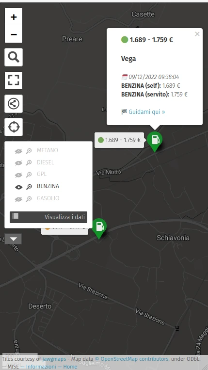

Mi sono imbattuto nel link del MISE (MInistero dello Sviluppo Economico) tramite il gruppo Telegram di **OpenStreetMap Italia** in cui si parlava di usare gli open data del MISE per aggiornare la mappa di openstreetmap riguardo i distributori.
I file in formato CSV sono scaricabili da qui: https://www.mise.gov.it/index.php/it/open-data/elenco-dataset/2032336-carburanti-prezzi-praticati-e-anagrafica-degli-impianti

I 2 file sono:
- **Prezzo alle 8 di mattina (csv)**: contiene la lista dei prezzi per ciascun impianto e ciascun tipo di carburante
- **Anagrafica degli impianti attivi (csv)**: contiene la lista impianti

Entrambi i file CSV sono legati tra loro dalla colonna **IdImpianto**.

Tramite uno script PHP ho fatto in modo che vengano scaricati entrambi e venga generato un file da importare su uMap in formato [GeoJSON](https://geojson.org/), uno standard aperto per gestire una struttura di dati geografici.

## Come funziona
Appena si effettua l'accesso occorre avvicinarsi alla propria zona con il tasto di geolocalizzazione o con il tasto di ricerca si può ricercare un luogo preciso. Dopo va cliccato il pulsante l'ultimo pulsante sulla sinistra a forma di cilindro per scegliere il tipo di carburante e apparirà in lista una serie di marcatori che sono i distributori.

Appaiono subito i prezzi dal minimo al massimo, infatti nei file CSV sono presenti i prezzi del self-service e quelli del servito. A volte sono uguali. A fianco dei prezzi c'è un pallino che indica:
- verde: prezzi aggiornati negli ultimi 3 giorni
- arancione: prezzi aggiornati fra 4 e 7 giorni
- rosso: prezzi aggiornati oltre 7 giorni

Al click sul marcatore appaiono ulteriori dettagli sul distributore e un pulsante **Guidami qui** per aprire l'app predefinita del telefono per navigare fino al distributore 🙌

### [🗺️ ACCEDI ALLA MAPPA ➡️ ](https://umap.openstreetmap.fr/it/map/distributori-prezzi-italia_932492)

## TO-DO
- avere un server in cui installare lo script e fare in modo che uMap aggiorni i punti ogni volta che ci sono aggiornamenti. Ora il caricamento del file in formato GeoJSON è manuale per cui la mappa non è aggiornata giorno per giorno

## Codice
https://github.com/loviuz/prezzi-distributori-italia-umap

https://gitea.it/loviuz/prezzi-distributori-italia-umap (mirror)