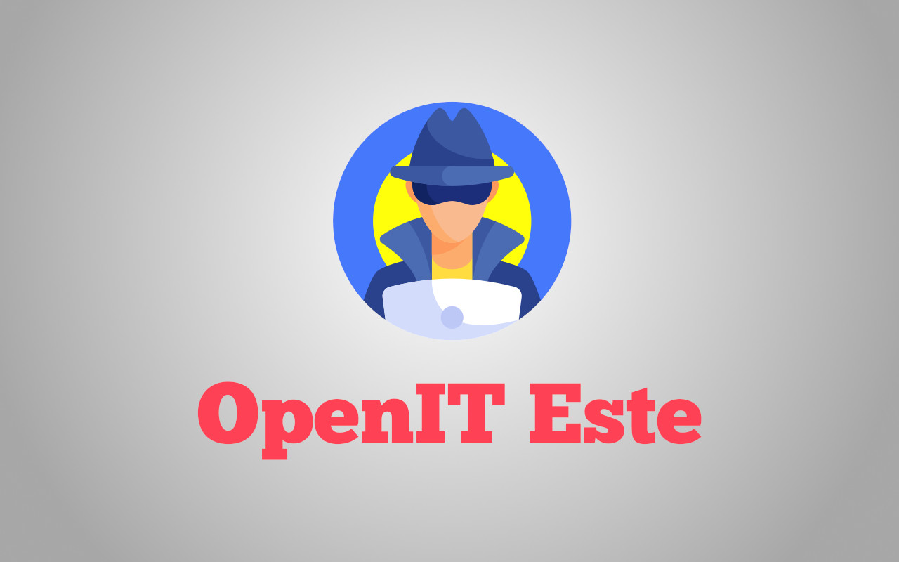

## Tanto tempo fa...

E' da tempo che vorrei rifondare un **LUG (Linux Users Group)**. Ne avevo fatto parte nel 2004 circa quando ero ancora alle scuole superiori nell'istituto tecnico di informatica. Con quel gruppo avevamo organizzato il nostro primo [Linux Day](https://www.linuxday.it) con pochissime persone, circa 10 se non ricordo male, per poi riprovarci gli anni successivi e devo dire che aumentando i partecipanti e organizzandolo in posti un po' più strategici siamo riusciti a fare un evento dove sono arrivate molte ma molte più persone!

Lo spirito di quel periodo era quello di trovarsi in compagnia il venerdì sera dopo cena fino a tardissimo (anche le 3 di notte 😱) con i propri portatili o, nel mio caso, con il "trasportabile": un pc fisso con case pesantissimo e monitor CRT 😆.

Al tempo non era ancora diffuso il concetto del cloud, si parlava di software, si sperimentavano le distribuzioni GNU/Linux più strane o le novità, si dava una mano ogni tanto a qualcuno che volesse provare Linux, sperando che quello che potevamo fare fosse confinato lì, nel territorio.

E invece, dopo che il gruppo lentamente si è sciolto a causa di tanti fattori ci si è persi di vista, ci si sentiva da casa per email, poi era il periodo di **Facebook** per cui qualcuno si era perso nei social. Credo che ognuno nel proprio piccolo abbia portato avanti questo interesse a modo suo. Personalmente ho portato il software libero a livello lavorativo perché nel 2011 ho aperto partita iva come libero professionista e ho portato avanti il mio progetto del gestionale open source [OpenSTAManager](/progetti/openstamanager), fino a condividerlo con ex-colleghi di lavoro che anch'essi si sono messi a lavorare in proprio fino a che abbiamo fondato un'azienda e abbiamo anche assunto per lavorare su questo software 😃.

## Cosa mancava?

Oggi però sentivo quel vuoto di dover fare qualcosa di più, slegato dal lavoro e che fosse utile socialmente, soprattutto perché ciò a cui tengo è vivere in un mondo dove il digitale è un po' ovunque ma avere la possibilità di usare il digitale in modo utile e trasparente, per migliorare la società, e non per soccombere a chi lo sfrutta per i propri interessi. E in certi casi l'uso sbagliato o poco trasparente di strumenti digitali ha un enorme potere negativo sulle persone, ecco quindi il mio desiderio di **rifondare un gruppo Linux nel territorio**.

I tempi sono cambiati e le persone non vedono grossi rischi nel breve termine. Vent'anni fa si lottava per avere nei propri pc software libero rispetto al software proprietario chiuso. Oggi il nostro pc o dispositivo è solo un'interfaccia per mandare i nostri dati e vedere come vengono elaborati: navigo su Facebook, metto like, commento e questo mi propone poi cosa leggere; faccio ricerche su Google e mi viene proposta pubblicità mirata perfettamente cucita sui miei interessi, e molto altro ancora. Voglio divulgare la mia visione di mondo digitale ideale, trasparente, aperto, che sia per le persone e che non le sfrutti per interessi di altri, e per fare questo vorrei poter creare un gruppo che condivida questo mio pensiero e mi aiuti a realizzarlo, almeno in questo territorio perché i gruppi Linux in Italia sono tanti, ma ci sono anche gruppi di hacker e associazioni che stanno già costruendo o lottando per dei diritti per cui vorrei anch'io fare la mia parte qui, a Este e dintorni.

Puoi unirti al gruppo Telegram di OpenIT Este da qui:

https://t.me/openit_este

